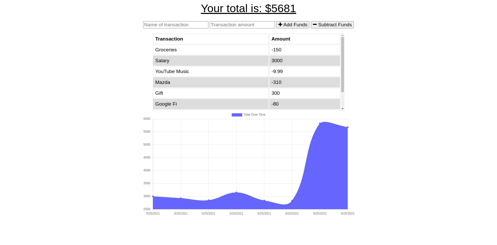

# Budget Tracker

  

  ## Table of Contents

  - [Description](#description)

  - [Deployed](#deployed)

  - [Screenshots](#screenshots)

  - [Technologies](#technologies)

  - [Installation](#installation)

  - [Contributing](#contributing)

  - [Tests](#tests)

  - [Questions](#questions)

  - [Licenses](#licenses)

  ## Description

  A budget-tracking web application with offline functionality. 

  ## Screenshos

  

  ## Technologies

  -React

  -JavaScript

  -MongoDB

  -Mongoose

  -Morgan

  -Node.js

  -Nodemon

  -Express

  -HTML
  
  -CSS

  ## Deployed

  https://damp-lake-65220.herokuapp.com/ 

  ## Contributing

  This application is free and open source software (FOSS). See License agreement.

  ## Tests

  To test offline functionality, disconnect from the internet. DO NOT RELOAD THE PAGE. 

  Continue to enter your transactions as normal. 

  Reconnect to the internet. The backend database will update and save your content when you reconnect. 

  ## Questions

  Visit my Github profile at http://www.github.com/balokdecoy.

  If you have questions, you can reach me via email at johnniesimpson88@gmail.com.

  ## Licenses
 Licensed under [GPL v3](https://www.gnu.org/licenses/gpl-3.0)

